# 세계 상식 퀴즈 게임
> 컴퓨터에게 명령 내리는 말(파이썬) 처음 배우기


## 1. 프로젝트 개요
> 본 프로젝트는 다양한 분야의 세계 상식을 퀴즈 형태로 학습할 수 있는 Python 콘솔 기반 프로그램을 구현함.
> 사용자는 국가와 수도, 세계 지리, 세계 역사, 과학, 우주·자연 등 여러 분야의 퀴즈를 풀고 새로운 문제를 직접 등록할 수 있음.  
> 또한 프로그램은 퀴즈 데이터와 최고 점수를 JSON 파일에 저장하여 종료 후에도 이전 상태를 유지가능함.

---
## 2. 목차

1. [프로젝트 개요](#1-프로젝트-개요)
2. [목차](#2-목차)
3. [퀴즈 주제 선정 이유](#3-퀴즈-주제-선정-이유)
4. [실행 방법](#4-실행-방법)
5. [기능 목록](#5-기능-목록)
6. [파일 구조](#6-파일-구조)
7. [데이터 파일 설명](#7-데이터-파일-설명)
8. [실행 및 검증 결과](#8-실행-및-검증-결과)
9. [과제 수행 체크리스트](#9-과제-수행-체크리스트)
---

## 3. 퀴즈 주제 선정 이유
> 세계 상식은 국가, 역사, 지리, 과학 등 다양한 분야를 포함하고 있어 문제를 지속적으로 추가하고 확장하기에 적합하다고 판단됨.  
> 대부분의 내용을 객관식 4지선다 형태로 구성하기 쉬우며, 난이도 조절도 용이함.  
> 또한 사용자가 새로운 퀴즈를 자유롭게 추가할 수 있어 프로그램을 지속적으로 발전시킬 수 있다는 점에서 프로젝트 주제로 선정.

### 3.1 퀴즈 생성 방법

- Prompt Format 
```text
세계 상식 퀴즈를 생성해 주세요.

다음 조건을 반드시 모두 만족해야 합니다.

[목적]
- Python 콘솔 기반 퀴즈 게임에서 사용할 데이터입니다.

[문제 수]
- 10문제를 생성합니다.

[카테고리]
- 국가와 수도

[출제 기준]
- 객관적으로 정답이 명확한 문제를 생성합니다.
- 일반 상식 수준의 난이도로 생성합니다.
- 동일하거나 유사한 문제는 생성하지 않습니다.
- 각 문제에는 정답이 하나만 존재해야 합니다.
- 오답 선택지도 실제로 헷갈릴 수 있는 항목으로 구성합니다.
- 애매하게 해석될 수 있는 표현은 피합니다.
- 지나치게 세부적인 연도나 암기 위주의 문제는 피합니다.
- 각 문제에는 정답을 직접 알려주지 않는 힌트를 하나 포함합니다.
- 힌트는 정답 자체의 명칭을 그대로 포함하지 않습니다.
- 힌트는 한 문장 정도로 간결하게 작성합니다.

[출력 형식]
아래 JSON 배열 형식으로만 출력합니다.
설명이나 Markdown 코드 블록은 출력하지 않습니다.

[
    {
        "category": "국가와 수도",
        "question": "프랑스의 수도는 어디입니까?",
        "choices": [
            "리옹",
            "마르세유",
            "파리",
            "니스"
        ],
        "answer": 3,
        "hint": "에펠탑과 루브르 박물관으로 유명한 도시입니다."
    }
]

조건
- answer는 1~4 번호입니다.
- choices의 순서는 랜덤하게 배치합니다.
- JSON만 출력합니다.
- 설명이나 Markdown은 출력하지 않습니다.

추가 검증

생성한 후 다음 사항을 스스로 검토한 뒤 수정하여 최종 결과만 출력합니다.

- 정답이 하나만 존재하는가?
- 오답도 충분히 그럴듯한가?
- 사실 오류가 없는가?
- 문제끼리 중복되지 않는가?
- answer 번호가 실제 정답 위치와 일치하는가?
- JSON 문법이 올바른가?
```

- 아래 `[카테고리]`에 대하여 
```text
[카테고리]
- 국가와 수도

[카테고리]
- 세계 지리

[카테고리]
- 세계 역사

[카테고리]
- 과학 상식

[카테고리]
- 우주·자연
```

- `학습 네이토`의 `Gemini 3 Flash (x0.5)` 모델을 이용하여 생성
---

## 4. 실행 방법


### 4.1 프로젝트 다운로드
#### 1) Git Clone
```bash
git clone https://github.com/jangsoopark-codyssey/02.pre-course-python-and-git-basic.git
```

#### 2) 직접 다운로드
- 웹 브라우저에서 `https://github.com/jangsoopark-codyssey/02.pre-course-python-and-git-basic` 이동 후 `"<> Code" -> "Download ZIP"` 

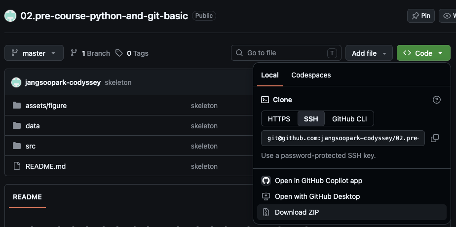

### 4.2 `scripts/run.sh` 스크립트 활용
```bash
cd scripts

./run.sh
```

### 4.3 `Python`을 이용하여 직접 실행

프로젝트 루트에서 다음 명령을 실행한다.

```bash
python src/main.py
```

### 4.4 실행 명령 인자

| 인자 | 설명 | 기본값 |
|---|---|---|
| `--data-file-path` | 데이터 파일이 위치한 디렉터리 경로 | `.env`의 `DATA_FILE_PATH` |
| `--data-file-name` | 상태 데이터 파일 이름 | `.env`의 `DATA_FILE_NAME` |

예시:

```bash
python src/main.py \
    --data-file-path=data \
    --data-file-name=state.json
```

명령행 인자가 명시적으로 전달되면 `.env`에서 불러온 값보다 우선하여 적용됨

---

## 5. 기능 목록

### 5.1 기본 기능

| 기능 | 설명 | 관련 데이터/동작 |
|---|---|---|
| 퀴즈 풀기 | 저장된 퀴즈를 출제하고 사용자의 정답 입력을 받아 정답/오답 여부를 출력한다. | `QuizGame.quiz_solve()` |
| 퀴즈 추가 | 카테고리, 문제, 선택지 4개, 정답 번호, 힌트를 입력하여 새로운 퀴즈를 등록한다. | 추가된 퀴즈를 `state.json`에 저장 |
| 퀴즈 목록 | 현재 등록되어 있는 전체 퀴즈 목록을 출력한다. | 카테고리와 문제 내용 출력 |
| 점수 확인 | 가장 최근 점수와 최고 점수를 확인한다. | `score.last`, `score.best` |
| 프로그램 종료 | 메뉴를 통해 프로그램 실행을 종료한다. | 정상 종료 |

### 5.2 보너스 기능

| 기능 | 설명 | 구현 방법 |
|---|---|---|
| 랜덤 출제 | 선택된 문제 수만큼 퀴즈를 무작위 순서로 출제한다. | `random.sample()` 사용 |
| 문제 수 선택 | 사용자가 전체 퀴즈 수 범위 안에서 풀이할 문제 수를 직접 선택한다. | 숫자 범위 입력 검증 |
| 힌트 기능 | 각 문제의 힌트를 선택적으로 확인할 수 있다. 힌트를 사용해 정답을 맞히면 획득 점수를 차감한다. | `Quiz.hint`, `Quiz.show_hint()` |
| 퀴즈 삭제 | 원하는 퀴즈 번호를 선택하여 삭제한다. | 삭제 후 `state.json` 갱신 |
| 점수 기록 | 게임 종료 시 날짜/시간, 문제 수, 점수를 기록한다. | `score.history` |
| 점수 기록 조회 | 이전 게임의 점수 기록을 메뉴에서 확인한다. | `score_history_show()` |

### 5.3 예외 처리

| 상황 | 처리 방식 |
|---|---|
| 빈 입력 | 안내 메시지를 출력하고 다시 입력받는다. |
| 숫자가 아닌 입력 | 숫자 변환 실패를 처리하고 다시 입력받는다. |
| 허용 범위를 벗어난 숫자 | 유효한 입력 범위를 안내하고 다시 입력받는다. |
| `KeyboardInterrupt` (`Ctrl+C`) | 프로그램이 비정상 종료되지 않도록 처리하고 다시 입력받는다. |
| `EOFError` | 입력 스트림 종료를 처리하고 다시 입력받는다. |
| `state.json`이 없는 경우 | 기본 데이터를 이용하여 새로운 상태 파일을 생성한다. |
| JSON 데이터 손상 | 손상 사실을 안내한 후 기본 데이터로 복구한다. |
| 파일 읽기/쓰기 오류 | `OSError`를 처리하고 오류 메시지를 출력한다. |

### 5.4 자동화 테스트

Python 표준 라이브러리 `unittest`를 이용하여 주요 기능을 자동 검증한다.

전체 테스트는 다음 명령으로 실행할 수 있다.

```bash
cd scripts
./unit-test.sh
```

또는 직접 unittest 실행

```bash
python -m unittest discover -s tests -v
```

테스트 구성은 다음과 같다.

| 테스트 영역 | 주요 검증 항목 |
|---|---|
| `Quiz` | 객체 생성, 속성 저장, 정답/오답 판별 |
| 입력 처리 | 문자열 입력, 숫자 입력, 범위 검사, 잘못된 입력 재시도 |
| Yes/No 입력 | `y`, `n` 입력 및 잘못된 입력 재시도 |
| JSON 파일 | 저장 및 다시 불러오기 |
| State 초기화 | 데이터 파일이 없는 경우 자동 생성 |
| State 복구 | 손상된 JSON 파일을 기본 데이터로 복구 |
| State 갱신 | 기존 데이터를 유지하면서 일부 상태만 갱신 |
| 점수 관리 | 최근 점수, 최고 점수, 히스토리 갱신 |

자동화 테스트 실행 결과는 `Ran 20 tests`와 `OK`를 통해 전체 테스트 통과 여부를 확인할 수 있다.

---
## 6. 파일 구조

> `data/state.json`은 프로그램 실행 과정에서 자동으로 생성되는 상태 데이터 파일이며 Git 추적 대상에서는 제외한다.

`tree -a -I '.git|__pycache__'`

```bash
...$ tree -a -I '.git|__pycache__'
.
├── assets
│   └── figure
│       ├── 01.git-init.png
│       └── ...
├── data
│   └── .env
├── .gitignore
├── README.md
├── scripts
│   ├── run.sh
│   └── unit-test.sh
├── src
│   ├── application.py
│   ├── common
│   │   ├── constants.py
│   │   ├── definitions.py
│   │   ├── dotenv.py
│   │   ├── __init__.py
│   │   └── utils.py
│   ├── game
│   │   ├── __init__.py
│   │   └── quiz.py
│   └── main.py
└── tests
    ├── test_quiz.py
    ├── test_state.py
    └── test_utils.py

8 directories, 30 files
```

### 6.1 주요 디렉터리 및 파일

| 경로 | 설명 |
|---|---|
| `assets/figure/` | README 및 과제 제출에 사용하는 실행 결과와 검증 스크린샷 저장 |
| `data/` | 프로그램 실행에 필요한 환경 설정 및 상태 데이터 저장 |
| `data/.env` | 데이터 파일 경로와 파일명 등의 환경 변수 설정 |
| `scripts/run.sh` | 퀴즈 프로그램 실행 스크립트 |
| `scripts/unit-test.sh` | 단위 테스트 자동 실행 스크립트 |
| `src/main.py` | 프로그램 진입점. 환경 설정과 상태 데이터를 불러오고 `Application` 실행 |
| `src/application.py` | 메뉴 출력 및 사용자 메뉴 선택에 따른 기능 실행 |
| `src/common/constants.py` | 프로그램에서 사용하는 기본 데이터 정의 |
| `src/common/definitions.py` | 프로젝트 경로 및 공통 설정값 정의 |
| `src/common/dotenv.py` | `.env` 파일을 읽어 환경 변수로 설정 |
| `src/common/utils.py` | 입력 검증, JSON 입출력, 상태 데이터 관리 등의 공통 기능 |
| `src/game/quiz.py` | `Quiz`, `QuizGame` 클래스 및 퀴즈 게임 로직 구현 |
| `tests/test_quiz.py` | `Quiz`, `QuizGame` 관련 단위 테스트 |
| `tests/test_state.py` | 상태 데이터 저장, 초기화 및 복구 관련 테스트 |
| `tests/test_utils.py` | 공통 유틸리티 함수 관련 단위 테스트 |
| `.gitignore` | Git에서 추적하지 않을 파일 및 디렉터리 설정 |
| `README.md` | 프로젝트 설명 및 실행 방법 문서 |


---
## 7. 데이터 파일 설명

프로그램의 상태 데이터는 `${project_root}/data/state.json`에 JSON 형식으로 저장된다.

`state.json`은 애플리케이션 설정, 퀴즈 데이터, 점수 및 풀이 기록을 저장하며, 프로그램을 종료한 후 다시 실행해도 이전 상태를 유지하기 위해 사용한다.

파일은 UTF-8 인코딩을 사용한다.

`state.json`이 존재하지 않는 경우 `constants.py`에 정의된 `DEFAULT_DATA`를 이용하여 자동으로 생성한다. 파일의 JSON 형식이 손상된 경우에도 `DEFAULT_DATA`를 이용하여 초기 상태로 복구한다.

> `state.json`은 프로그램 실행 과정에서 생성 및 변경되는 상태 데이터이므로 Git 추적 대상에서 제외한다.

### 7.1 스키마

`state.json`의 최상위 데이터는 `application`, `score`, `quizzes`로 구성된다.

```json
{
    "application": {
        "title": "세계 상식 퀴즈",
        "menu": {
            "title": "세계 상식 퀴즈",
            "options": [
                "퀴즈 풀기",
                "퀴즈 추가",
                "퀴즈 목록",
                "퀴즈 삭제",
                "점수 확인",
                "점수 기록",
                "종료"
            ],
            "prompt": ">> "
        },
        "version": "2.0.0"
    },
    "score": {
        "last": 0,
        "best": 0,
        "history": []
    },
    "quizzes": [
        {
            "category": "국가와 수도",
            "question": "독일의 수도는 어디입니까?",
            "choices": [
                "뮌헨",
                "프랑크푸르트",
                "베를린",
                "함부르크"
            ],
            "answer": 3,
            "hint": "브란덴부르크 문이 위치한 이 도시는 과거 동서로 나뉘었던 역사가 있습니다."
        }
    ]
}
```

### 7.2 세부사항

#### `application`

프로그램의 기본 설정과 메뉴 구성 정보를 저장한다.

| 필드 | 자료형 | 설명 |
|---|---|---|
| `title` | `str` | 프로그램의 제목 |
| `menu` | `dict` | 메뉴 구성 정보 |
| `menu.title` | `str` | 메뉴 화면에 사용할 제목 |
| `menu.options` | `list` | 사용자에게 제공되는 메뉴 목록 |
| `menu.prompt` | `str` | 메뉴 번호 입력을 요청할 때 출력하는 문자열 |
| `version` | `str` | 애플리케이션 데이터 버전 |

현재 메뉴는 다음 7개의 기능으로 구성된다.

1. 퀴즈 풀기
2. 퀴즈 추가
3. 퀴즈 목록
4. 퀴즈 삭제
5. 점수 확인
6. 점수 기록
7. 종료

#### `score`

사용자의 퀴즈 점수와 풀이 기록을 저장한다.

| 필드 | 자료형 | 설명 |
|---|---|---|
| `last` | `int`, `float` | 가장 최근에 완료한 퀴즈의 점수 |
| `best` | `int`, `float` | 현재까지 기록한 최고 점수 |
| `history` | `list` | 퀴즈 풀이 기록 |

프로그램을 처음 실행했을 때의 기본값은 다음과 같다.

```json
{
    "last": 0,
    "best": 0,
    "history": []
}
```

퀴즈 풀이가 완료되면 최근 점수인 `last`를 갱신하고, 기존 최고 점수보다 높은 경우 `best`도 갱신한다.

또한 각 게임의 결과는 `history`에 다음 정보를 포함하여 저장한다.

| 필드 | 자료형 | 설명 |
|---|---|---|
| `datetime` | `str` | 퀴즈를 완료한 날짜와 시간 |
| `num_questions` | `int` | 해당 게임에서 출제된 문제 수 |
| `score` | `int`, `float` | 해당 게임에서 획득한 점수 |

힌트를 사용하지 않고 정답을 맞히면 `1점`, 힌트를 사용하고 정답을 맞히면 `0.5점`을 획득하므로 점수에는 정수 또는 실수가 저장될 수 있다.

#### `quizzes`

퀴즈 데이터는 `quizzes` 배열에 저장되며, 하나의 퀴즈는 다음 필드로 구성된다.

| 필드 | 자료형 | 설명 |
|---|---|---|
| `category` | `str` | 퀴즈가 속한 카테고리 |
| `question` | `str` | 문제 내용 |
| `choices` | `list` | 4개의 객관식 선택지 |
| `answer` | `int` | 정답에 해당하는 선택지 번호 (`1`~`4`) |
| `hint` | `str` | 문제 풀이 시 선택적으로 확인할 수 있는 힌트 |

기본 데이터에는 다음 5개의 카테고리가 포함되어 있다.

| 카테고리 | 문제 수 |
|---|---:|
| 국가와 수도 | 10 |
| 세계 지리 | 10 |
| 세계 역사 | 10 |
| 과학 상식 | 10 |
| 우주·자연 | 10 |
| **합계** | **50** |

따라서 프로그램 최초 실행 시 총 50개의 기본 퀴즈를 사용할 수 있다.

퀴즈 추가 기능으로 새로운 문제를 등록하거나 퀴즈 삭제 기능으로 기존 문제를 삭제하면 변경된 `quizzes` 데이터가 `state.json`에 저장된다.

### 7.3 초기화 및 복구

프로그램은 `state.json`을 불러오는 과정에서 파일의 존재 여부와 JSON 데이터의 유효성을 확인한다.

| 상황 | 처리 방법 |
|---|---|
| `state.json`이 존재하지 않음 | `DEFAULT_DATA`를 이용하여 새로운 `state.json` 생성 |
| 정상적인 JSON 파일 | 저장된 상태 데이터를 불러와 프로그램 실행 |
| JSON 형식이 손상됨 | 안내 메시지를 출력하고 `DEFAULT_DATA`로 복구 |
| 파일 읽기 오류 | `OSError`를 처리하고 오류 메시지 출력 |
| 파일 쓰기 오류 | `OSError`를 처리하고 저장 실패 메시지 출력 |

이를 통해 데이터 파일이 존재하지 않거나 손상된 경우에도 기본 데이터를 이용하여 프로그램을 다시 실행할 수 있도록 구성하였다.
---

## 8. 실행 및 검증 결과

프로그램의 주요 기능과 예외 처리 동작을 실제 실행을 통해 검증하였다.

### 8.1 개발 환경

Python 및 Git 버전과 개발 환경을 확인한다.

```bash
python --version
git --version
git config --list
```

<details>

<summary> Screenshot </summary>

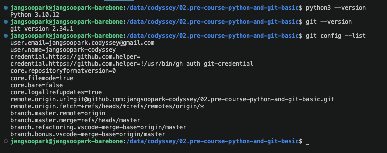

</details>

### 8.2 프로그램 실행

프로그램을 실행하여 메인 메뉴가 정상적으로 출력되는지 확인한다.

```bash
cd scripts
./run.sh
```

<details>

<summary> Screenshot </summary>

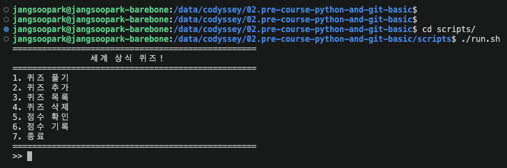

</details>

### 8.3 퀴즈 풀기

퀴즈 풀기 기능에서 다음 항목을 확인한다.

- 풀이할 문제 수 선택
- 문제 랜덤 출제
- 4개의 선택지 출력
- 힌트 사용 여부 선택
- 힌트 출력
- 정답 및 오답 판별
- 최종 점수 계산

<details>

<summary> Screenshot </summary>

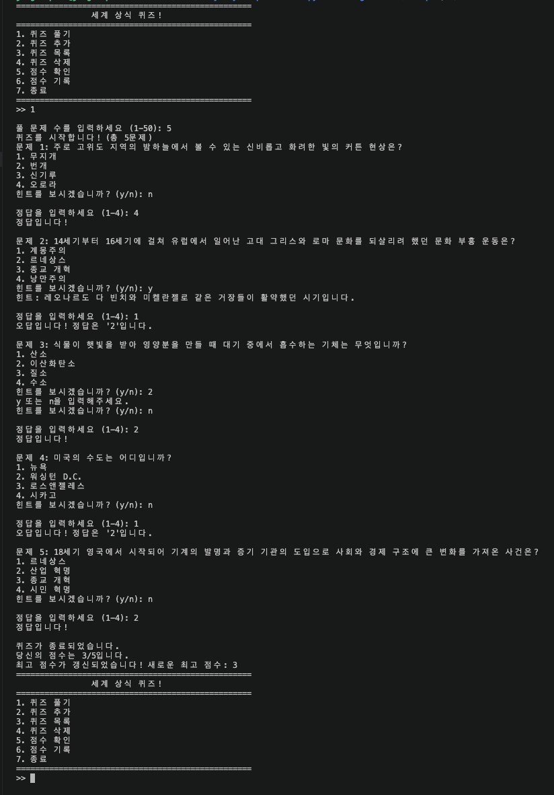

</details>


### 8.4 퀴즈 추가 및 목록 조회

새로운 퀴즈의 카테고리, 문제, 선택지, 정답, 힌트를 입력하여 퀴즈를 추가한다.

```
[
    {
        "category": "세계 지리",
        "question": "세계에서 가장 긴 산맥으로, 남아메리카 대륙의 서쪽 해안을 따라 남북으로 길게 뻗어 있는 산맥은 무엇입니까?",
        "choices": [
            "히말라야 산맥",
            "로키 산맥",
            "안데스 산맥",
            "알프스 산맥"
        ],
        "answer": 3,
        "hint": "고대 잉카 문명이 번성했던 곳으로, 칠레와 페루 등 여러 나라에 걸쳐 있습니다."
    }
]
```

<details>

<summary> Screenshot </summary>

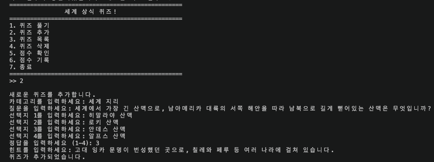
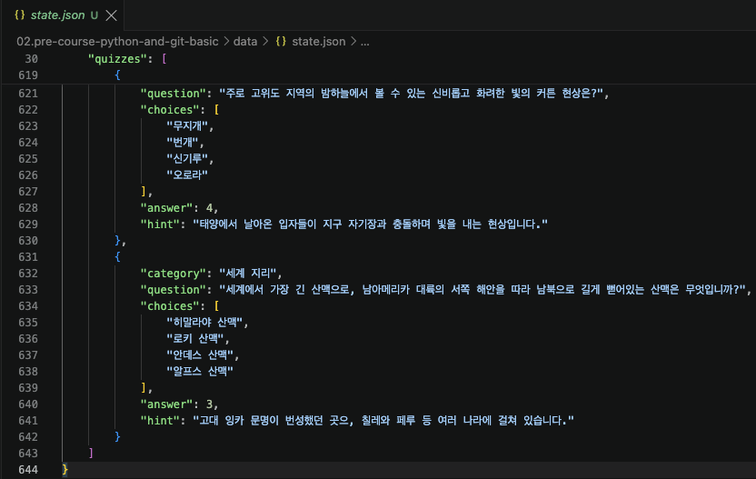

</details>


추가된 퀴즈가 퀴즈 목록에 정상적으로 반영되는지 확인한다.

<details>

<summary> Screenshot </summary>

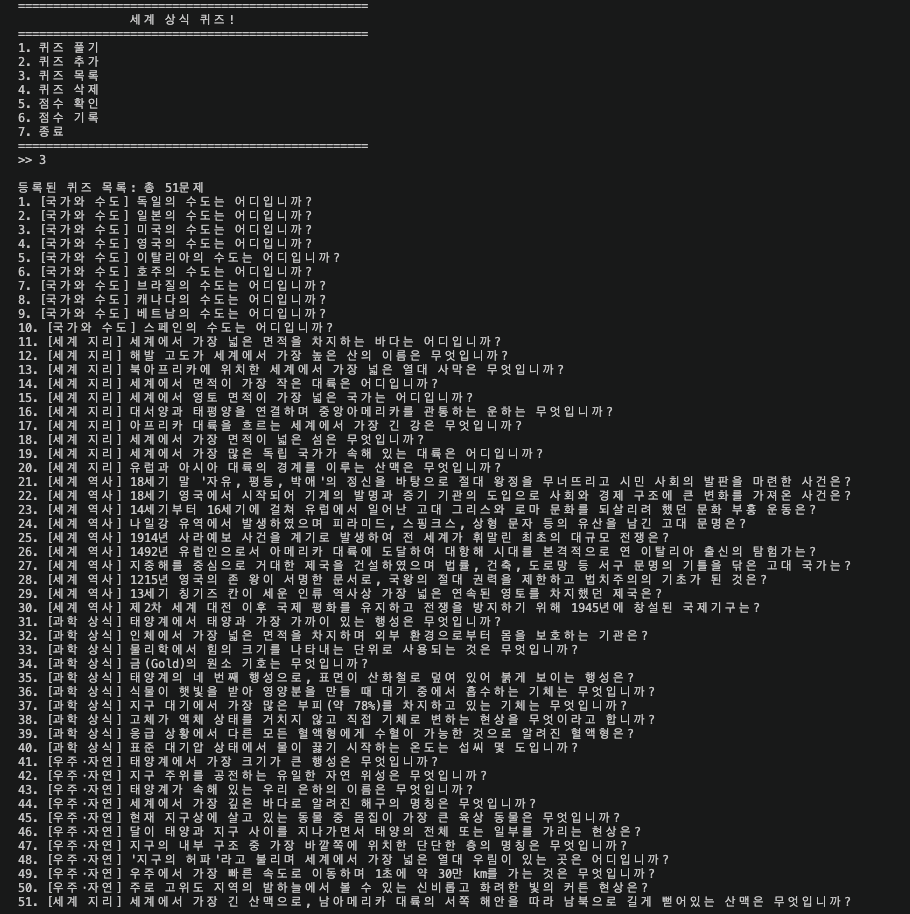
</details>


### 8.5 퀴즈 삭제

등록된 퀴즈를 선택하여 삭제하고 변경 사항이 정상적으로 반영되는지 확인한다.

<details>

<summary> Screenshot </summary>

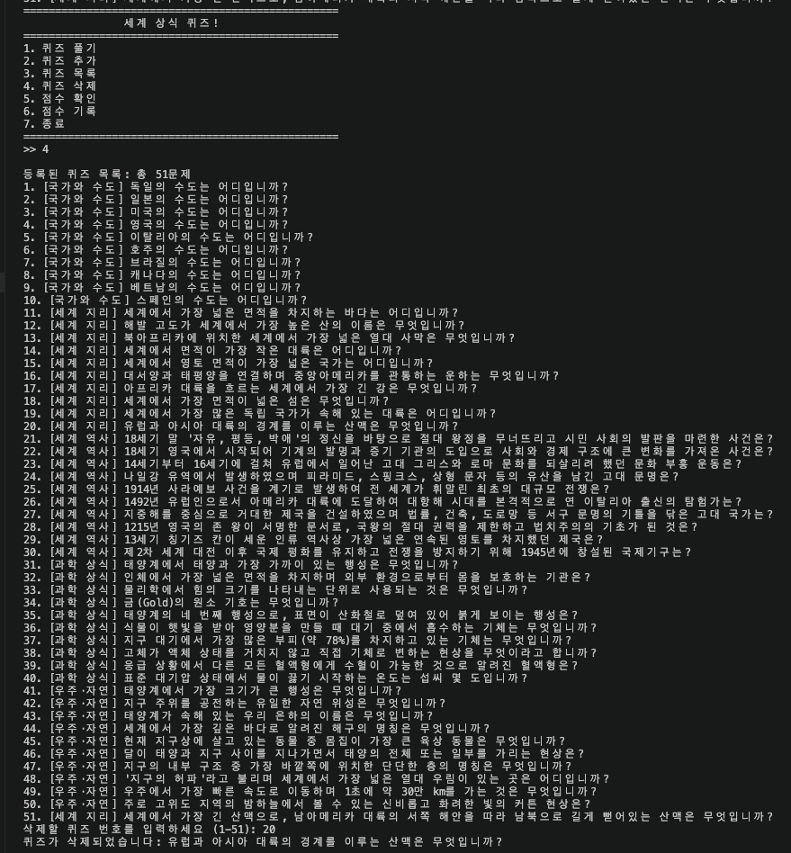
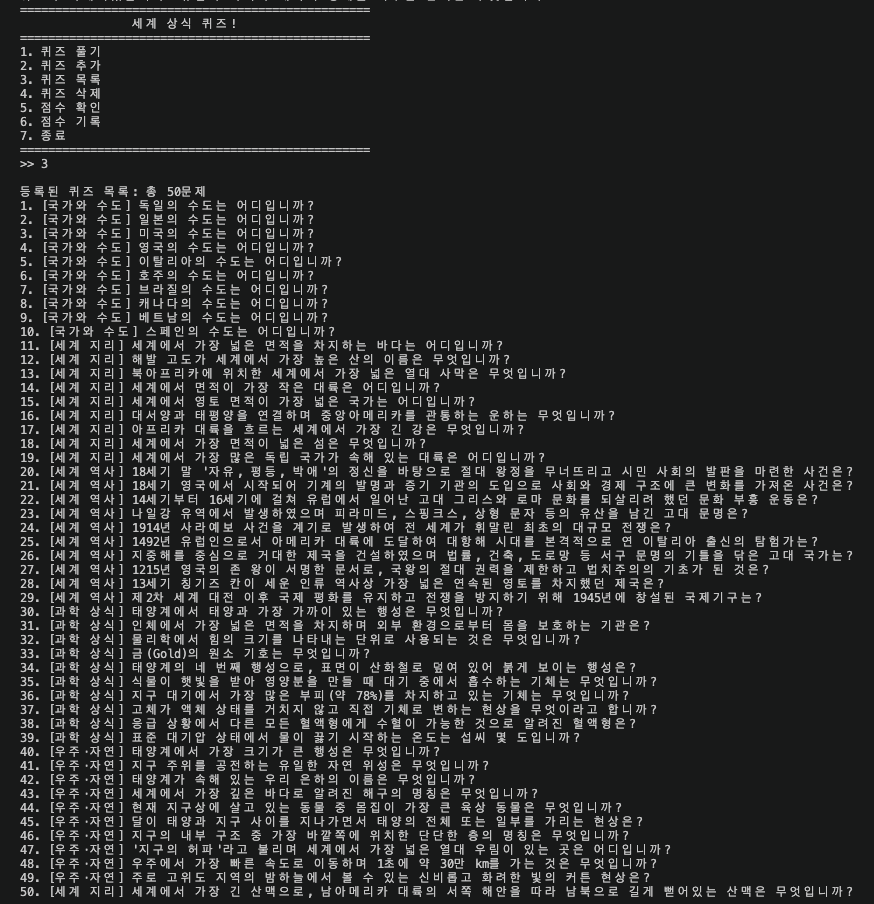
</details>


### 8.6 점수 및 기록 확인

퀴즈 풀이 결과가 최근 점수와 최고 점수에 정상적으로 반영되는지 확인한다.

<details>

<summary> Screenshot </summary>

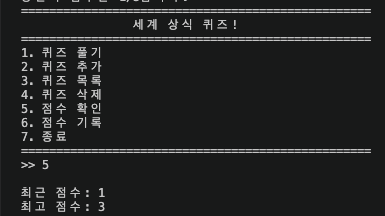

</details>

퀴즈를 완료한 날짜/시간, 문제 수, 점수가 기록되는지 확인한다.

<details>

<summary> Screenshot </summary>

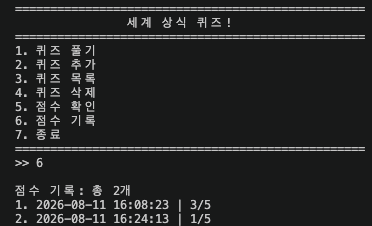

</details>

<details>

<summary> Screenshot </summary>

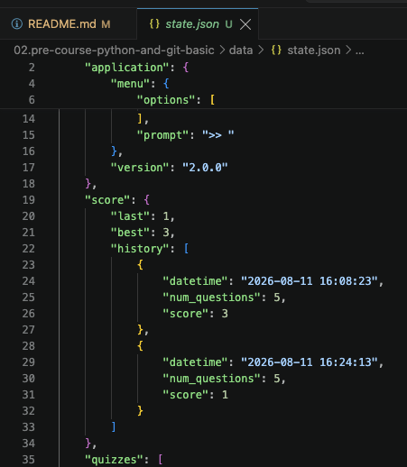

</details>


### 8.7 잘못된 입력 처리

사용자 입력 과정에서 잘못된 값이 입력되더라도 프로그램이 종료되지 않고 다시 입력받는지 확인한다.

검증 항목:

| 입력 | 검증 내용 |
|---|---|
| 빈 입력 | 값을 입력하도록 안내 |
| `abc` | 숫자 변환 실패 처리 |
| `0` | 허용 범위보다 작은 숫자 처리 |
| 범위보다 큰 숫자 | 허용 범위를 안내하고 재입력 |
| `Ctrl+C` | `KeyboardInterrupt` 처리 |
| `Ctrl+D` | `EOFError` 처리 |

<details>

<summary> Screenshot </summary>

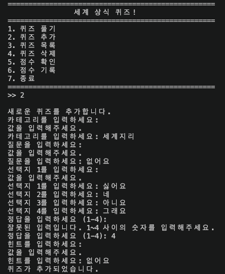

</details>

<details>

<summary> Screenshot </summary>

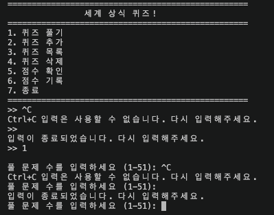

</details>

<details>

<summary> Screenshot </summary>

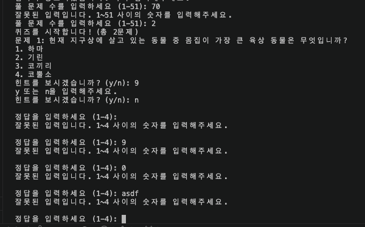

</details>
<details>

<summary> Screenshot </summary>


</details>

<details>
<summary> Screenshot </summary>

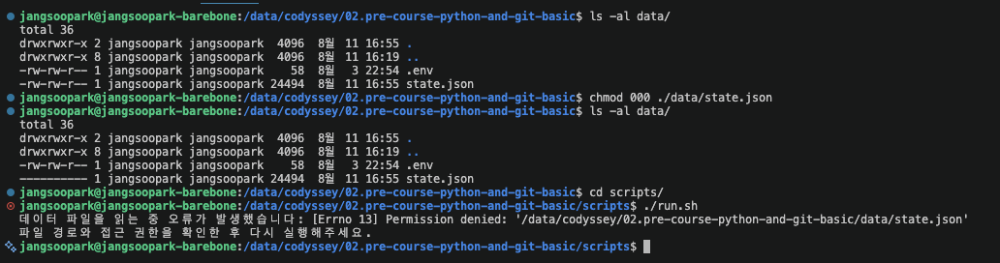

</details>


### 8.8 데이터 파일 예외 처리

#### `state.json`이 존재하지 않는 경우

`state.json`이 없는 상태에서 프로그램을 실행하여 기본 데이터로 새로운 상태 파일이 생성되는지 확인한다.

<details>

<summary> Screenshot </summary>

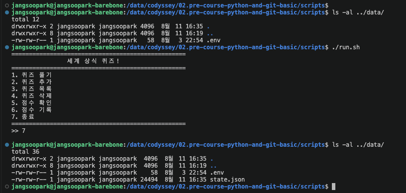

</details>

#### `state.json`이 손상된 경우

올바르지 않은 JSON 데이터를 저장한 후 프로그램을 실행하여 손상된 파일을 감지하고 기본 데이터로 복구하는지 확인한다.

<details>

<summary> Screenshot </summary>

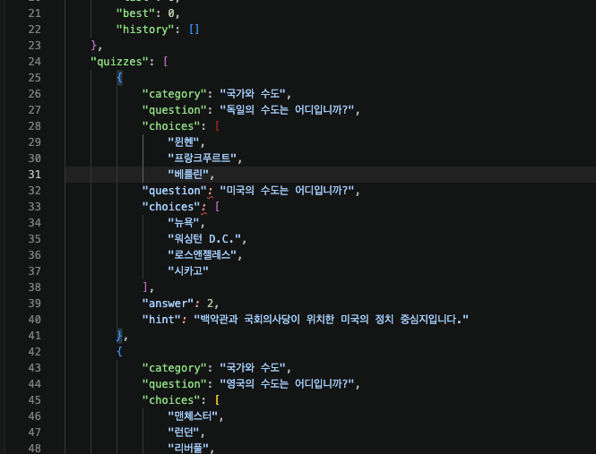
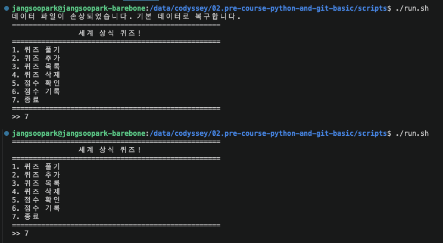

</details>

### 8.9 자동화 테스트

Python 표준 라이브러리 `unittest`를 이용하여 구현된 기능을 자동으로 검증한다.

```bash
cd scripts
./unit-test.sh
```

전체 테스트가 성공하면 다음 결과를 확인할 수 있다.

```text
Ran 20 tests

OK
```

<details>

<summary> Screenshot </summary>

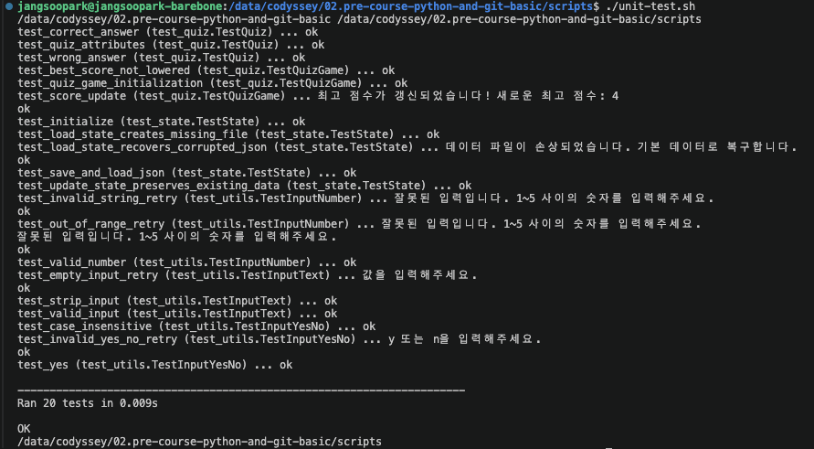

</details>


### 8.10 Git 작업 이력

브랜치 생성 및 병합을 포함한 Git 작업 이력을 확인한다.

```bash
git log --oneline --graph --all --decorate
```

<details>

<summary> Screenshot </summary>

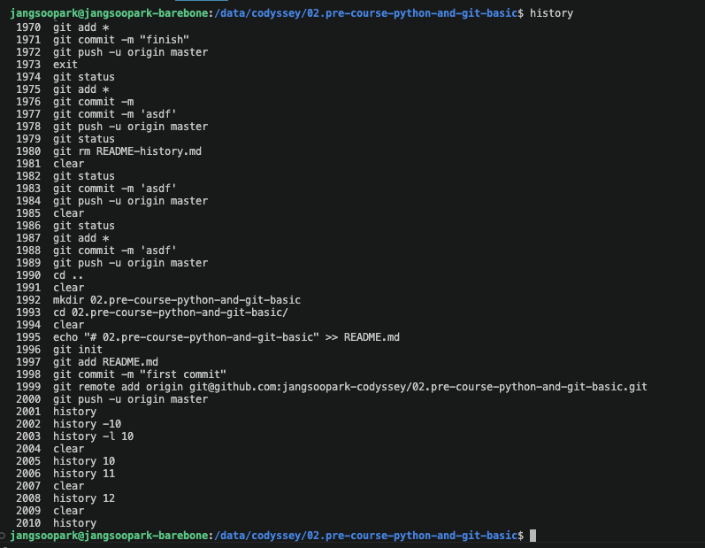
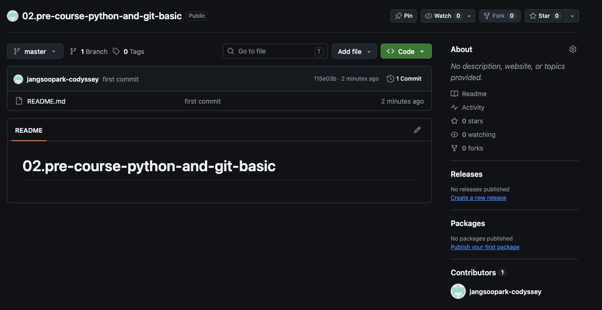
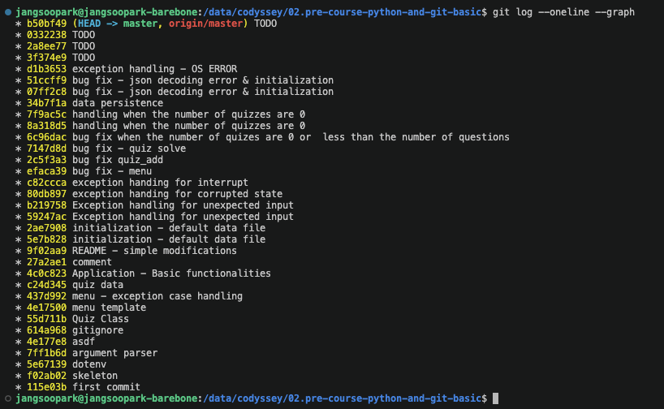

</details>

<details>

<summary> Screenshot </summary>

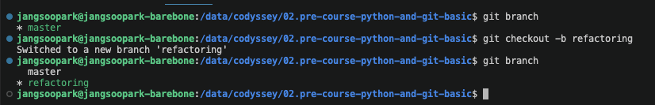
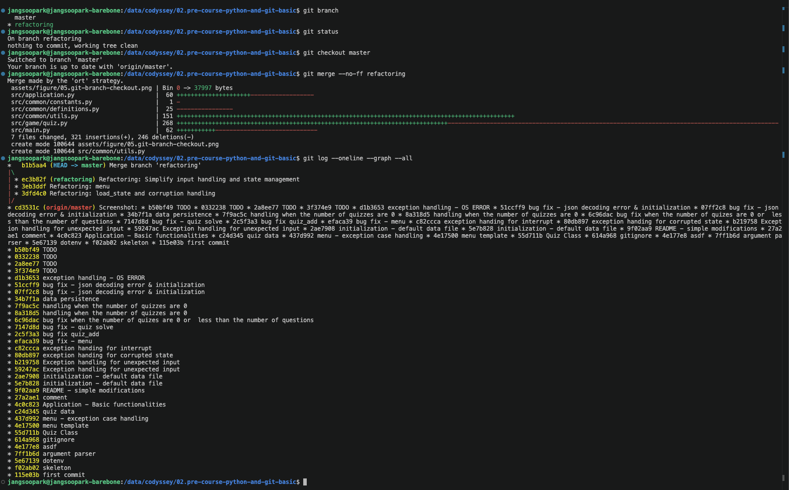
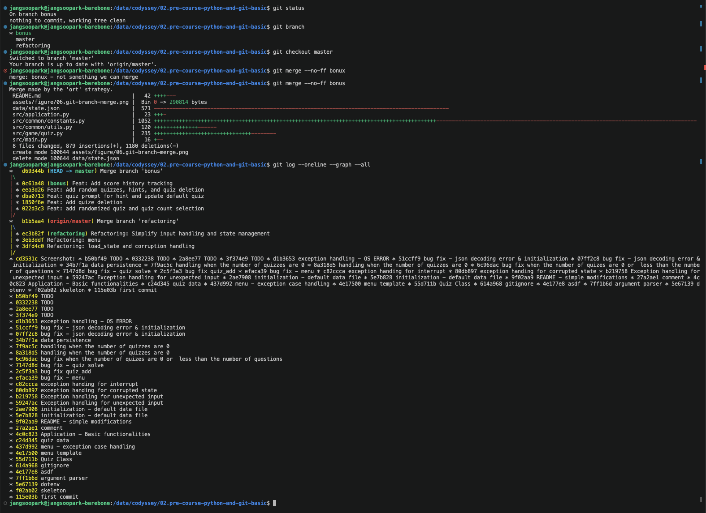

</details>

<details>

<summary> Screenshot </summary>

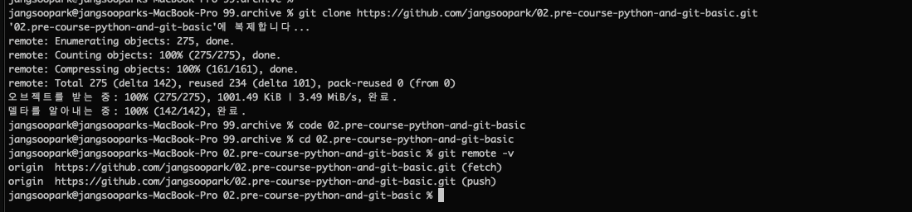
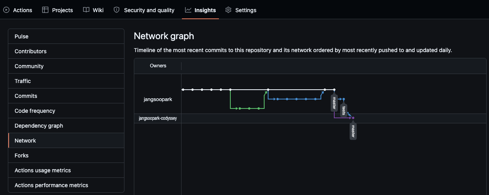

</details>

<details>

<summary> Screenshot </summary>

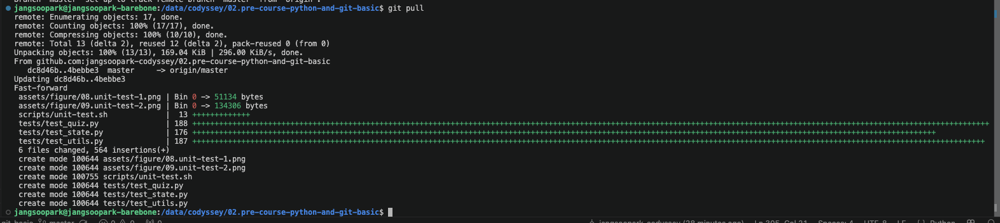
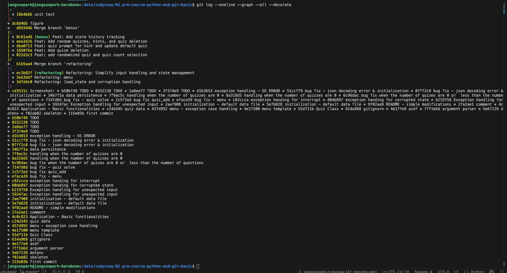

</details>


---

## 9. 과제 수행 체크리스트

| 항목 | 상태 |
|---|:---:|
| Python 퀴즈 게임 기본 기능 구현 | ✅ |
| `Quiz`, `QuizGame` 클래스 구현 | ✅ |
| JSON 데이터 저장 및 불러오기 | ✅ |
| 입력 및 예외 처리 | ✅ |
| Git 기능 단위 커밋 | ✅ |
| Git 브랜치 생성 및 병합 | ✅ |
| Git `clone` 실습 | ✅ |
| Git `pull` 실습 | ✅ |
| 리팩토링 | ✅ |
| 보너스 기능 | ✅ |
| 자동화 테스트 | ✅ |
| README 작성 | ✅ |
---
